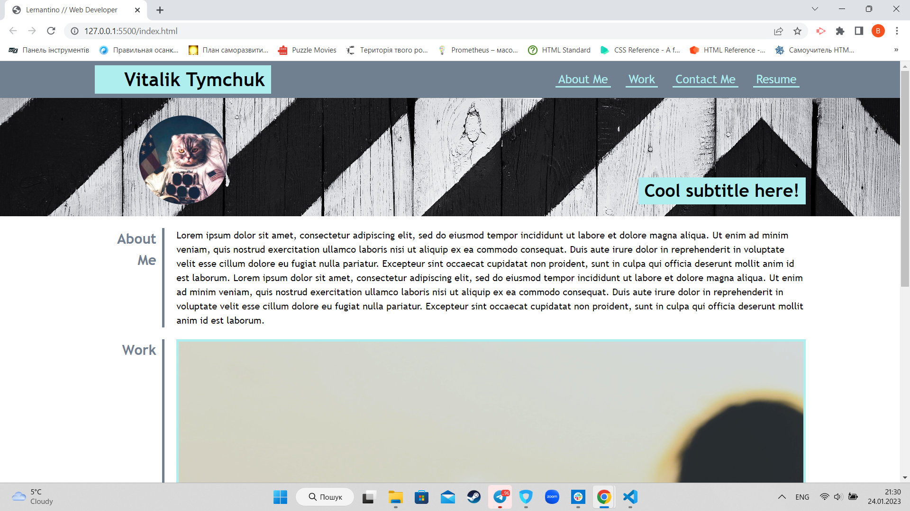
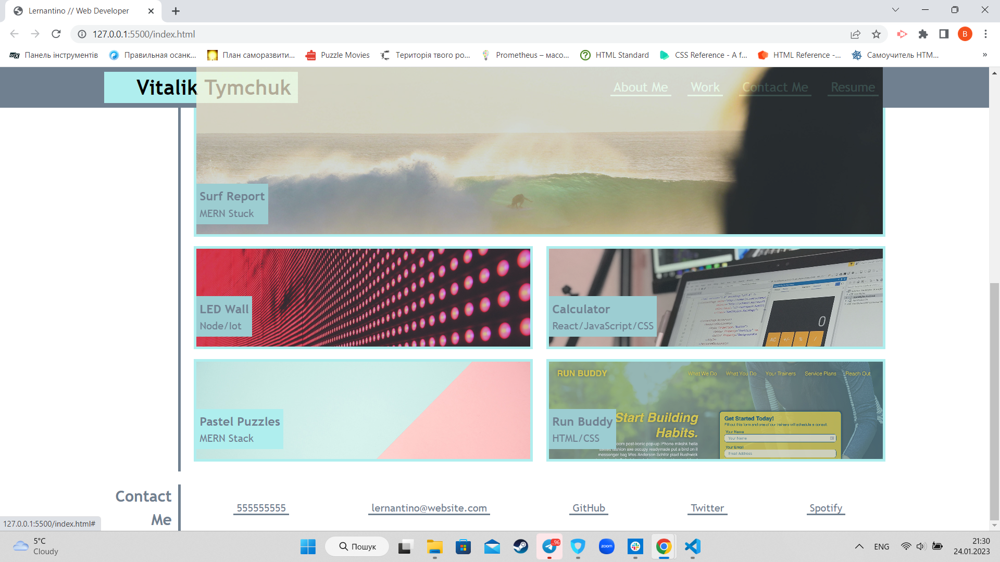

# Portfolio

## Description
This project's taks was to create a porfolio using HTML and CSS. To create projects section was used display flex. Nav bar and contact sections use links.
Here user can see:
- Info about developer;
- developers' projects;
- contact info;

## Installation

N/A

## Usage

In order to see the portfolio follow the link. In order to create a password click on "Generate Password" button. Than follow the instructions.
https://hllmtrxwrld.github.io/Portfolio/

## Credits

N/A

## License

N/A